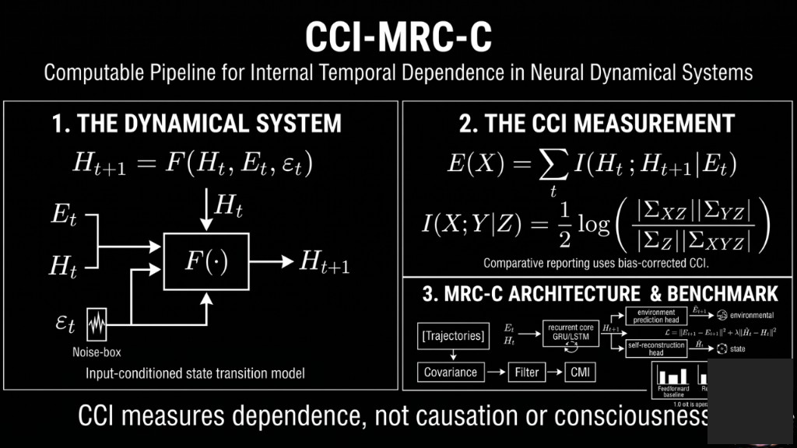
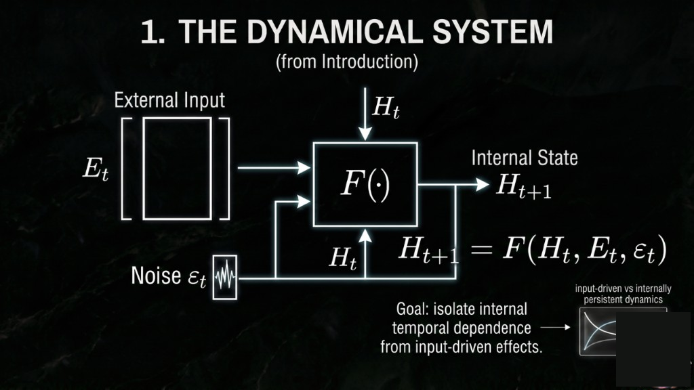
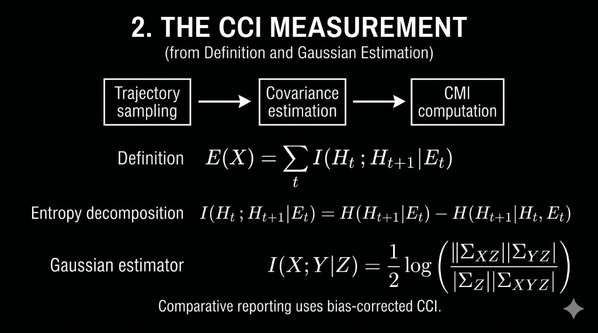
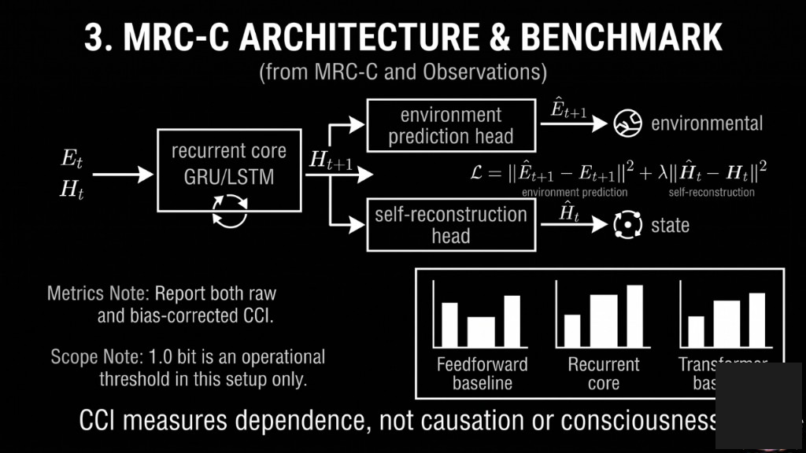

# CCI-MRC-C
## Computable Research Pipeline for Closed Causal Information in Neural Dynamical Systems

[](https://github.com/NiViGG/cci-mrc-c/actions/workflows/ci.yml)

**Closed Causal Information (CCI)** is a diagnostic metric for internal temporal
dependence in sequential systems.

$$
I(H_t; H_{t+1}\mid E_t)
$$

It measures how much future internal state depends on current internal state
after conditioning on external input.

> CCI measures dependence, not causation or consciousness.

## Overview

We consider a system with internal state `H_t`, external input `E_t`, and
stochastic noise `epsilon_t`:

$$
H_{t+1}=F(H_t,E_t,\epsilon_t)
$$

The core objective is to isolate the contribution of internal dynamics from
input-driven effects.

$$
E(X)=\sum_{t=1}^{T} I(H_t;H_{t+1}\mid E_t)
$$

## Conceptual Diagram (Vision Layer)


_Conceptual interpretation only. Metric claims are defined in `CLAIMS.md`._

The concise vision synthesis from the external blueprint is documented in
`theory/master_blueprint.md` and explicitly tagged as Interpretive Layer (Vision).

## Visual Pipeline Panels



Panel breakdown:







Visuals are explanatory overlays for communication and do not replace metric
evidence in `results/` and claim boundaries in `CLAIMS.md`.

## Conceptual Protocols (Attributed)

- `protocols/public_v1.md`
- `protocols/transparent_v1.md`
- `protocols/diffused_v1.md`
- `protocols/trap_v1.md`
- Attribution and source mapping: `protocols/ATTRIBUTION.md`
- Validation note: `docs/datsyuk_protocols_validation.md`

These protocols are interpretive references and do not replace metric evidence.

## Interactive CCI Calculator (Experimental)

The repository includes an experimental CCI calculator workflow (Gaussian CMI):

- Input tensors: `H_t`, `H_t1`, `E_t`
- Covariance estimation with numerical stabilization
- Cholesky-based log-det computation
- Adaptive jitter policy for near-singular covariance
- Outputs: CCI (bits), rolling CCI trend, optional delta-CCI, used jitter diagnostics

### Expected input shapes

- `H_t`: `[N, d_h]`
- `H_t1`: `[N, d_h]`
- `E_t`: `[N, d_e]`

## Gaussian Estimation

$$
H(X)=\frac{1}{2}\log\left((2\pi e)^d|\Sigma_X|\right)
$$

$$
I(X;Y\mid Z)=\frac{1}{2}\log\frac{|\Sigma_{XZ}||\Sigma_{YZ}|}{|\Sigma_Z||\Sigma_{XYZ}|}
$$

The implementation uses covariance factorization with Cholesky stabilization.

## Benchmark Reporting Policy

- Primary benchmark comparison uses `bias_corrected` CCI.
- `raw` CCI is retained for diagnostics but can be inflated in high-dimensional
  finite-sample settings.
- Transformer non-zero CCI is conditional dependence evidence only and not proof
  of autonomy.

## Why Frontier Labs May Care

- Hidden-state diagnostics beyond outputs.
- Regime-shift monitoring (rolling CCI / delta-CCI).
- Architecture-level comparison (bias-corrected CCI).
- Safety-relevant exploratory signal (latent loop persistence).

## Reproducibility Card

- Primary metric: `bias_corrected = max(raw_cmi - permutation_null_mean, 0)`.
- Raw retained for diagnostics.
- Seeds + per-run in `results/cci_values.json`.
- Cholesky + adaptive jitter (`1e-7..1e-4`).
- `pytest` sanity + shape checks.
- Interpretation boundaries and non-claims are governed by `CLAIMS.md`.

## What CCI Captures

- Internal temporal dependence
- Hidden-state persistence
- Regime shifts in latent dynamics (via CCI trend / delta-CCI)

## Open Collaboration Requests

- Non-Gaussian CMI estimators.
- Cross-model benchmark suite.
- Online regime monitoring.
- External validation datasets.

Open an issue with a reproducible benchmark proposal.

See `docs/applications.md` for evidence-tiered application scope.
Documentation updates should preserve boundaries defined in `CLAIMS.md`.

## Non-Claims (Important)

- No causal proof.
- No consciousness detection claim.
- `1.0 bit` is operational in this setup only, not universal.

## Applications

### Current evidence-backed use cases

- AI model diagnostics: reactive vs recurrent separation
- Training regime shift monitoring
- Hidden-state persistence tracking
- Architecture comparison (FF/RNN/Transformer)
- Anomaly/regime change signal in agent loops (exploratory)

### Hypotheses / future validation

- Medical, legal, and policy contexts are future validation hypotheses and not
  current evidence-backed claims in this repository.
- Consciousness-related interpretation remains speculative and cannot be inferred
  from CCI alone.
- See `docs/applications.md` for full evidence tiers and `CLAIMS.md` for scope.

## Benchmarks in This Repository

- Feedforward vs recurrent comparison
- Training dynamics tracking
- Input invariance test (noise vs structured)
- Transformer baseline evaluation

Comparative benchmark reporting uses bias-corrected CCI as primary value.

## Note on thresholds

`1.0 bit` is an operational threshold in this setup. It is not a universal
constant and must be interpreted with assumptions from `CLAIMS.md`.

## Quick Start

```bash
pip install -r requirements.txt
python run_all.py
```
