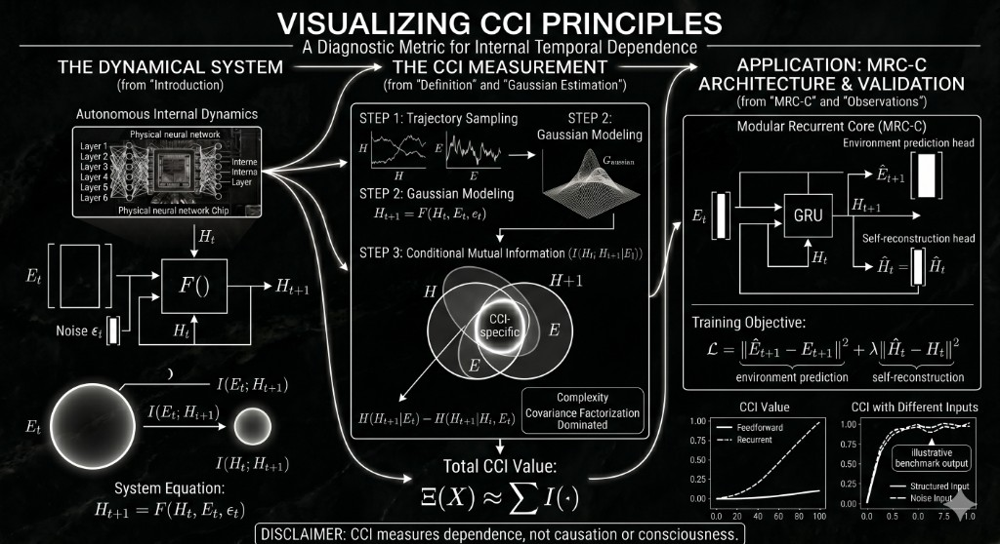

# CCI-MRC-C
## Computable Research Pipeline for Closed Causal Information in Neural Dynamical Systems

**Closed Causal Information (CCI)** is a diagnostic metric for internal temporal
dependence in sequential systems.

\[
I(H_t; H_{t+1}\mid E_t)
\]

It measures how much future internal state depends on current internal state
after conditioning on external input.

> CCI measures dependence, not causation or consciousness.

## Overview

We consider a system with internal state `H_t`, external input `E_t`, and
stochastic noise `epsilon_t`:

\[
H_{t+1}=F(H_t,E_t,\epsilon_t)
\]

The core objective is to isolate the contribution of internal dynamics from
input-driven effects.

\[
E(X)=\sum_{t=1}^{T} I(H_t;H_{t+1}\mid E_t)
\]

## Conceptual Diagram (Vision Layer)



_Conceptual interpretation only. Metric claims are defined in `CLAIMS.md`._

The concise vision synthesis from the external blueprint is documented in
`theory/master_blueprint.md` and explicitly tagged as Interpretive Layer (Vision).

## Interactive CCI Calculator (Experimental)

The repository includes an experimental CCI calculator workflow (Gaussian CMI):

- Input tensors: `H_t`, `H_t1`, `E_t`
- Covariance estimation with numerical stabilization
- Cholesky-based log-det computation
- Adaptive jitter policy for near-singular covariance
- Outputs: CCI (bits), rolling CCI trend, optional delta-CCI, used jitter diagnostics

### Expected input shapes

- `H_t`: `[N, d_h]`
- `H_t1`: `[N, d_h]`
- `E_t`: `[N, d_e]`

## Gaussian Estimation

\[
H(X)=\frac{1}{2}\log\left((2\pi e)^d|\Sigma_X|\right)
\]

\[
I(X;Y\mid Z)=\frac{1}{2}\log\frac{|\Sigma_{XZ}||\Sigma_{YZ}|}{|\Sigma_Z||\Sigma_{XYZ}|}
\]

The implementation uses covariance factorization with Cholesky stabilization.

## What CCI Captures

- Internal temporal dependence
- Hidden-state persistence
- Regime shifts in latent dynamics (via CCI trend / delta-CCI)

## What CCI Does Not Claim

- Not a causal proof
- Not a consciousness detector
- Not a legal/personhood criterion

## Applications

### Current evidence-backed use cases

- AI model diagnostics: reactive vs recurrent separation
- Training regime shift monitoring
- Hidden-state persistence tracking
- Architecture comparison (FF/RNN/Transformer)
- Anomaly/regime change signal in agent loops (exploratory)

### Hypotheses / future validation

- Medical, legal, and policy contexts are future validation hypotheses and not
  current evidence-backed claims in this repository.
- Consciousness-related interpretation remains speculative and cannot be inferred
  from CCI alone.
- See `docs/applications.md` for full evidence tiers and `CLAIMS.md` for scope.

## Benchmarks in This Repository

- Feedforward vs recurrent comparison
- Training dynamics tracking
- Input invariance test (noise vs structured)
- Transformer baseline evaluation

## Note on thresholds

`1.0 bit` is an operational threshold in this setup. It is not a universal
constant and must be interpreted with assumptions from `CLAIMS.md`.

## Quick Start

```bash
pip install -r requirements.txt
python run_all.py
```
